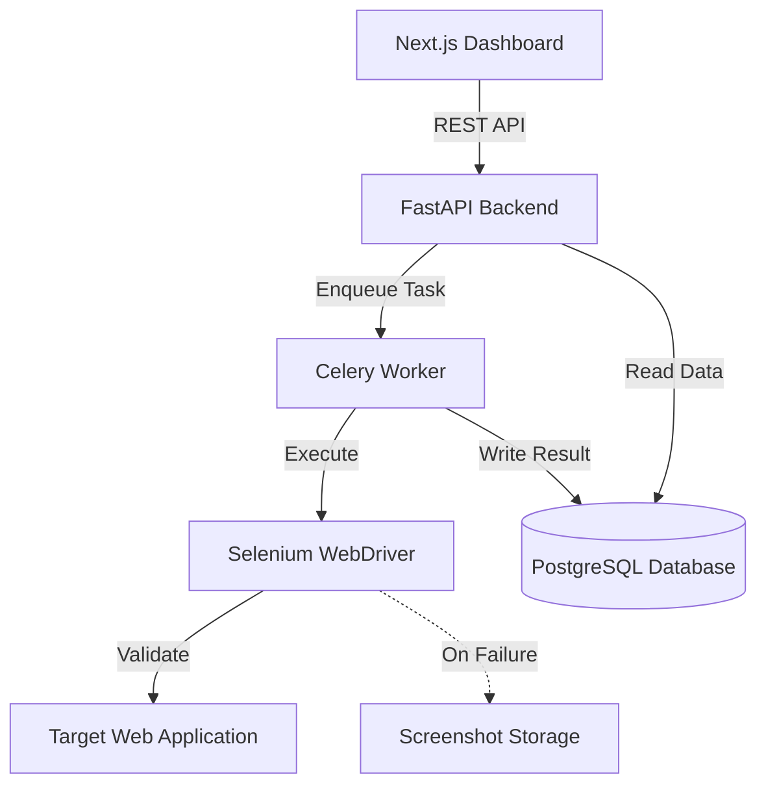

<h1 align="center">Automated Web Testing Framework</h1>

<div align="center">
  
  
  
  
  
</div>

<br>

<p align="center">
  An enterprise-grade, scalable automation framework engineered to streamline quality assurance. Validate critical web workflows, capture execution evidence, and manage testing via a robust API and modern dashboard.
</p>

---

## ⚡ Overview

Manual testing creates bottlenecks in agile development cycles. This framework provides an automated solution to seamlessly test complex user flows (such as Authentication and Checkout). By combining **Selenium WebDriver** for reliable browser interaction with a **FastAPI** backend, the architecture allows for highly concurrent, API-driven test execution. 

A companion **Next.js** dashboard provides insights into test metrics, flaky tests, and execution history.

## 🌟 Key Features

- **End-to-End Workflow Validation**: Built-in Page Object Model (POM) scripts covering Login, Signup, and Payment processes.
- **Resilient Execution**: Engineered with custom waiting strategies to minimize flaky tests across dynamic DOMs.
- **Automated Bug Logging & Evidence**: Instantly captures and saves high-resolution screenshots when an assertion fails or an element times out.
- **API-First Architecture**: Trigger tests, query execution statuses, and generate reports programmatically via FastAPI endpoints.
- **Asynchronous Task Queue**: Uses Celery (w/ Redis) for non-blocking test execution, allowing scalable parallel test runs.

## 🏗️ Architecture



## 🚀 Getting Started

### Prerequisites
- Python 3.10+
- Node.js (for the dashboard)
- Google Chrome & ChromeDriver

### Local Setup

**1. Clone the repository**
```bash
git clone https://github.com/Utkarshxtripathi/Automated-Web-Testing-Framework.git
cd Automated-Web-Testing-Framework
```

**2. Configure the Backend Environment**
```bash
cd backend
python -m venv venv
source venv/bin/activate  # On Windows: venv\Scripts\activate
pip install -r requirements.txt
```

**3. Run Database Migrations**
```bash
alembic upgrade head
```

**4. Start the Application**
```bash
uvicorn app.main:app --reload
```
The API documentation (Swagger UI) will be available at `http://localhost:8000/docs`.

### Running Tests Locally

To execute the test suite directly from the command line:
```bash
pytest app/tests/
```
Failed tests will automatically drop a PNG screenshot in the `screenshots/` directory for debugging.

## 📊 Documentation & Reports

Detailed technical documentation, including the project abstract, literature review, and execution outcomes, can be found in [`Final_Report.md`](./Final_Report.md).

## 🤝 Contributing

Contributions, issues, and feature requests are welcome! Feel free to check the [issues page](https://github.com/Utkarshxtripathi/Automated-Web-Testing-Framework/issues).

## 📜 License

This project is licensed under the MIT License - see the LICENSE file for details.
